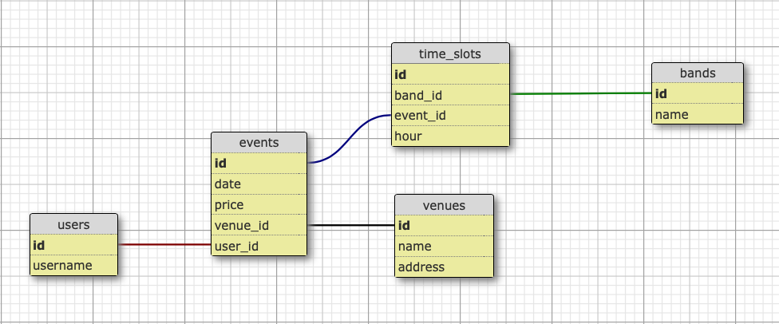

[![LinkedIn][linkedin-shield]][linkedin-url]

<!-- PROJECT LOGO -->
 

  <a href="https://github.com/BrieucBadasonic/skagenda"> Moonstomp Agenda </a>

  

    My first post Le Wagon bootcamp project
     
     
    <a href="https://moonstomp-agenda.herokuapp.com">Go to the website</a>
  

<!-- TABLE OF CONTENTS -->

  
<h2 style="display: inline-block">Table of Contents</h2>

  <ol>
    <li>
      <a href="#about-the-project">About The Project</a>
      <ul>
        <li><a href="#built-with">Built With</a></li>
      </ul>
    </li>
    <li>
      <a href="#getting-started">Getting Started</a>
      <ul>
        <li><a href="#prerequisites">Prerequisites</a></li>
        <li><a href="#installation">Installation</a></li>
      </ul>
    </li>
    <li><a href="#usage">Usage</a></li>
    <li><a href="#roadmap">Roadmap</a></li>
    <li><a href="#contributing">Contributing</a></li>
    <li><a href="#license">License</a></li>
    <li><a href="#contact">Contact</a></li>
    <li><a href="#acknowledgements">Acknowledgements</a></li>
  </ol>

<!-- ABOUT THE PROJECT -->
## About The Project

I wanted to keep on solidify my backend knowledge after finishing my Web Dev. bootcamp at Le Wagon Berlin in march 2021.

The purpose of this website is to centralize upcoming soul, rocksteady and ska show in Europe so fan's doen't have to follow tons
of Facebook groups to be aware of interestings shows around them.

Anybody will be able to add a new show but they will have to be validated by an admin before being published.
I want that mechanism so we make sure the added event a related to the Music scene we ant to promote and we will check
that those event are not promoting any kind of discriminations.

## Built With

* Ruby On Rails framework
* PostgreSQL Database
* HTML, CSS, SCSS and Javascript
* Heroku for production

## Database schema

## Tech I want to solidify

* Authentication & Authorisation

I'm using the DEVISE gem to deal with authentication.
I'm using the PUNDIT gem to deal with authorization.

User don't need to log in te see she index of the events.

User will have to log in to add a new event .
                            edit or delete a show they had created.

Some user will be defined as "Admin users".
Those user will have an extra tab in the nav bar to "Validate events".
Admin will have the right to edit and delete any events.

* Nested forms with 1:n and n:n relations

Forms are one of the most important part of any web based app.
I want to deeply understand how i can generate forms that will create or update records in
diffrent tables od my Database at the same time.
simple form in the view and accepts_nested_attributes_for in the models

* Unit and System Testing - in progress

I'm aware that testing is one of the most valuable skills I need to learn and master before
applying for my first web dev. job.
I will use MINITEST and CAPYBARA gem to write test and interact with the webpage.

* Continuous integration - in progress

Being able to test our app everytime I push to git is a very important part of the testing process.
I will do continuous integrations via Github actions.

### Contact

Brieuc Labiouse - [Email](brieuclabiouse@gmail.com)

<!-- MARKDOWN LINKS & IMAGES -->

[linkedin-shield]: https://img.shields.io/badge/-LinkedIn-black.svg?style=for-the-badge&logo=linkedin&colorB=555
[linkedin-url]: https://www.linkedin.com/in/brieuc-labiouse/
